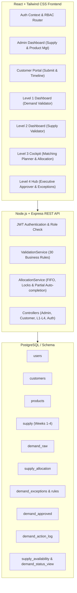

# Implementation Plan: Micron Supply Chain Demand Management System

Build a production-ready, full-stack **Supply Chain Demand Management System** for Micron with complete backend (Node.js + Express), PostgreSQL database schema & seed scripts, and a modern frontend (React + Tailwind CSS) featuring role-based dashboards for Admin, Customer, and Levels 1–4 approvers.

---

## User Review Required

> [!IMPORTANT]
> - **Dual Database Mode**: To ensure out-of-the-box developer experience even if a local PostgreSQL daemon is not running on Windows, the database layer will support PostgreSQL via `pg` by default, with an optional SQLite/in-memory fallback adapter for quick local testing without external database dependencies.
> - **All 30 Business Logic Rules**: Every rule specified across Level 1 (Demand Validator), Level 2 (Supply Validator), Level 3 (Matching Planner), and Level 4 (Executive Approver) plus partial allocation auto-completion will be implemented as modular, unit-testable methods in `ValidationService` and `AllocationService`.
> - **Code Format**: As requested, all files will be generated with complete, production-ready code with `[FILE: ...]`, `[LANGUAGE: ...]`, and `[CODE]` tags alongside actual project files written to the workspace.

---

## Architecture & System Design

---

## Proposed Changes

### 1. Database Layer (`backend/database/` & `backend/config/`)

#### [NEW] [schema.sql](file:///c:/Users/HP/OneDrive/Desktop/Folder/MICRON/backend/database/schema.sql)
- Full PostgreSQL schema matching the specification: `users`, `customers`, `products`, `supply`, `demand_raw`, `demand_action_log`, `supply_allocation`, `exception_rules`, `demand_exceptions`, `demand_approved`, `notifications`.
- Indexes, views (`supply_availability`, `demand_status_view`), check constraints, and default rules.

#### [NEW] [seed.sql](file:///c:/Users/HP/OneDrive/Desktop/Folder/MICRON/backend/database/seed.sql)
- Seed data with:
  - 1 Admin user (`admin@micron.com`)
  - 4 Approver users (`level1@micron.com`, `level2@micron.com`, `level3@micron.com`, `level4@micron.com`)
  - 2 Customer users (`apple_buyer@apple.com`, `spot_buyer@techstore.com`)
  - 2 Customers: Strategic Tier (Apple Inc., High Priority, $10M Credit) & Spot Tier (TechStore Ltd, Low Priority, $50k Credit)
  - 3 Products: High-Bandwidth Memory HBM3E (Active, Premium), DDR5 Server DRAM (Active, Standard), Discontinued Legacy DDR3 (Discontinued)
  - Supply data for Month 9 (September 2026), Weeks 1–4
  - Sample pending & partially allocated demands for demonstration

#### [NEW] [database.js](file:///c:/Users/HP/OneDrive/Desktop/Folder/MICRON/backend/config/database.js)
- PostgreSQL connection pool using `pg`.
- Migration and seeding runners, transaction helper (`query`, `getClient`, `withTransaction`).
- Automated schema creation check on server start.

---

### 2. Backend Services & Business Logic (`backend/services/`)

#### [NEW] [validationService.js](file:///c:/Users/HP/OneDrive/Desktop/Folder/MICRON/backend/services/validationService.js)
Implementation of all 30 business rules across 4 approval levels:
- **Level 1 Rules (1.1–1.7)**:
  - Rule 1.1: Customer exists & active
  - Rule 1.2: Customer credit limit check (`credit_limit >= requested_qty * unit_price`)
  - Rule 1.3: Product exists & `status = 'ACTIVE'`
  - Rule 1.4: Valid quantity (`0 < qty <= 999,999`)
  - Rule 1.5: Valid required date (`today <= date <= today + 90 days`)
  - Rule 1.6: Customer tier eligibility (Premium category requires Strategic or Standard tier)
  - Rule 1.7: No duplicate pending/approved demand for same customer, product, month
- **Level 2 Rules (2.1–2.6)**:
  - Rule 2.1: Supply plan exists for product & month
  - Rule 2.2: Supply plan is realistic (`available_quantity > 0` for at least one week)
  - Rule 2.3: Minimum threshold check (`SUM(available) >= requested * 0.3`)
  - Rule 2.4: Regional constraint (`customer.region = 'EU' -> category != 'RESTRICTED_EXPORT'`)
  - Rule 2.5: No supply shortfall > 50% (`SUM(available) >= requested * 0.5`, escalate/warn)
  - Rule 2.6: Planned vs actual consistency (`SUM(allocated) <= SUM(available)`)
- **Level 3 Rules (3.1–3.9)**:
  - Rule 3.1: Supply availability calculation (Full vs Partial allocation)
  - Rule 3.2: Customer tier priority (Strategic > High Priority > FCFS)
  - Rule 3.3: FIFO by required date for identical priority
  - Rule 3.4: Earliest-week allocation preference (Week 1 -> 2 -> 3 -> 4)
  - Rule 3.5: Profit margin check (`margin >= 8%`, flags exception `LOW_MARGIN` if failed)
  - Rule 3.6: Order value threshold (`total_value > $1,000,000`, flags exception `HIGH_VALUE`)
  - Rule 3.7: Overbooking prevention with row locking (`SELECT FOR UPDATE`)
  - Rule 3.8: Strategic customer high-priority exception handling
  - Rule 3.9: Allocation completeness & readiness for auto-completion
- **Level 4 Rules (4.1–4.8)**:
  - Rule 4.1: Review and resolution of open exceptions
  - Rule 4.2: Recalculate total customer exposure across all approved demands
  - Rule 4.3: Financial and revenue impact analysis (warning if margin < 5% or revenue < $10k)
  - Rule 4.4: Future month overcommitment restriction
  - Rule 4.5: Strategic customer override authority with mandatory audit comment
  - Rule 4.6: Spot customer restrictions (Strict Full allocation only, margin >= 10%)
  - Rule 4.7: Final approval actions (commit to `demand_approved`, or rollback allocations on rejection)
  - Rule 4.8: Concurrent demand balancing across monthly supply

#### [NEW] [allocationService.js](file:///c:/Users/HP/OneDrive/Desktop/Folder/MICRON/backend/services/allocationService.js)
- Atomic allocation engine with database transactions and `FOR UPDATE` row locks.
- Week-by-week supply distribution algorithm.
- Auto-completion engine: checks for `PARTIALLY_ALLOCATED` demands when new supply is added or on schedule, automatically allocating remaining supply and advancing fully filled demands to Level 4 with notifications.

#### [NEW] [demandService.js](file:///c:/Users/HP/OneDrive/Desktop/Folder/MICRON/backend/services/demandService.js)
- Demand lifecycle management, AI heuristic estimation for suggested quantity & confidence, timeline action logging.

---

### 3. Backend Controllers & Routes (`backend/controllers/` & `backend/routes/`)

#### [NEW] [authController.js](file:///c:/Users/HP/OneDrive/Desktop/Folder/MICRON/backend/controllers/authController.js) & [auth.js](file:///c:/Users/HP/OneDrive/Desktop/Folder/MICRON/backend/routes/auth.js)
- JWT authentication (`/api/auth/login`, `/api/auth/register`, `/api/auth/me`).
- Password hashing with `bcryptjs`.

#### [NEW] [adminController.js](file:///c:/Users/HP/OneDrive/Desktop/Folder/MICRON/backend/controllers/adminController.js) & [admin.js](file:///c:/Users/HP/OneDrive/Desktop/Folder/MICRON/backend/routes/admin.js)
- Supply management (`POST /api/admin/supply/add`, `GET /api/admin/supply/list`), triggers auto-completion on newly added supply.
- Product management (`POST /api/admin/products/create`, `GET /api/admin/products/list`).
- Customer management (`GET /api/admin/customers`, `POST /api/admin/customers/create`).

#### [NEW] [customerController.js](file:///c:/Users/HP/OneDrive/Desktop/Folder/MICRON/backend/controllers/customerController.js) & [customer.js](file:///c:/Users/HP/OneDrive/Desktop/Folder/MICRON/backend/routes/customer.js)
- Submit demand with immediate Level 1 rule verification (`POST /api/customer/demand/submit`).
- List demands (`GET /api/customer/demands`).
- Demand status and interactive timeline (`GET /api/customer/demand/:demand_id/timeline`).

#### [NEW] [levelsController.js](file:///c:/Users/HP/OneDrive/Desktop/Folder/MICRON/backend/controllers/levelsController.js) & [levels.js](file:///c:/Users/HP/OneDrive/Desktop/Folder/MICRON/backend/routes/levels.js)
- Level 1 endpoints (`GET /api/level1/demands`, `POST /api/level1/demand/:demand_id/approve`, `reject`).
- Level 2 endpoints (`GET /api/level2/demands`, `POST /api/level2/demand/:demand_id/approve`, `reject`).
- Level 3 endpoints (`GET /api/level3/demands`, `POST /api/level3/demand/:demand_id/allocate`, `GET /api/level3/supply/availability`).
- Level 4 endpoints (`GET /api/level4/demands`, `GET /api/level4/demand/:demand_id/exceptions`, `POST /api/level4/demand/:demand_id/approve`, `reject`).

#### [NEW] [notificationsController.js](file:///c:/Users/HP/OneDrive/Desktop/Folder/MICRON/backend/controllers/notificationsController.js) & [notifications.js](file:///c:/Users/HP/OneDrive/Desktop/Folder/MICRON/backend/routes/notifications.js)
- Unread notifications, mark as read, system notifications on level changes and auto-completions.

#### [NEW] [server.js](file:///c:/Users/HP/OneDrive/Desktop/Folder/MICRON/backend/server.js) & [app.js](file:///c:/Users/HP/OneDrive/Desktop/Folder/MICRON/backend/app.js)
- Express application wiring, CORS, error handling middleware, background cron / interval for partial allocation sweep.

---

### 4. Frontend Application (`frontend/`)

#### [NEW] [Vite + React Setup](file:///c:/Users/HP/OneDrive/Desktop/Folder/MICRON/frontend/package.json)
- React 18, Lucide React icons, Tailwind CSS / Vanilla CSS modern design system with Micron tech aesthetic (deep slate dark palette, neon cyan / emerald accents, glassmorphism, glowing telemetry indicators).

#### [NEW] [Auth & Role Context](file:///c:/Users/HP/OneDrive/Desktop/Folder/MICRON/frontend/src/context/AuthContext.jsx)
- Authentication state management, JWT decoding, user session persistence, easy role switcher for instant demonstration/testing across all 6 roles.

#### [NEW] [Components & Dashboards](file:///c:/Users/HP/OneDrive/Desktop/Folder/MICRON/frontend/src/components/)
- **Common UI**: `Navbar.jsx`, `Sidebar.jsx`, `DemandCard.jsx`, `RuleViolationAlert.jsx`, `TimelineView.jsx`, `Modal.jsx`, `NotificationBell.jsx`.
- **Admin**: `AdminDashboard.jsx`, `SupplyManagement.jsx` (interactive 4-week supply grid & product editor).
- **Customer**: `CustomerDashboard.jsx`, `DemandSubmit.jsx` (live credit and date validation preview), `DemandTimeline.jsx`.
- **Level 1 (Demand Validator)**: `Level1Dashboard.jsx` (Credit limit gauge, validation rule pass/fail checklist).
- **Level 2 (Supply Validator)**: `Level2Dashboard.jsx` (Monthly supply coverage bars, shortfall warnings).
- **Level 3 (Matching Planner)**: `Level3Dashboard.jsx`, `MatchingPlanner.jsx` (Week 1-4 allocation sliders, live margin calculator, AI suggested quantity, high-value and low-margin warning badges).
- **Level 4 (Executive Approver)**: `Level4Dashboard.jsx`, `ExecutiveApprover.jsx` (Financial impact breakdown: revenue, profit, margin %, open exceptions acknowledgment, strategic override comments).

---

## Verification Plan

### Automated Tests & Verification
1. **Database Schema & Seed Script Verification**:
   - Run seed script to verify table creation, view creation, constraints, and test records.
2. **Backend API Endpoints Testing**:
   - Test authentication: login with `admin@micron.com`, `level1@micron.com`, etc.
   - Test Level 1 validation: submit valid demand vs. credit-limit exceeding demand.
   - Test Level 2 supply check: verify 30% and 50% supply availability logic.
   - Test Level 3 allocation: verify atomic row locking, partial allocation, and exception generation.
   - Test Auto-completion: trigger new supply addition and verify partial allocation auto-allocation.
   - Test Level 4 final approval: verify `demand_approved` creation and supply reservation commit.
3. **Frontend Build & Interactive Testing**:
   - Run `npm run build` / verify React frontend compiles cleanly.
   - Test UI with browser subagent or local dev server: navigate through Admin, Customer, L1, L2, L3, L4 dashboards.
